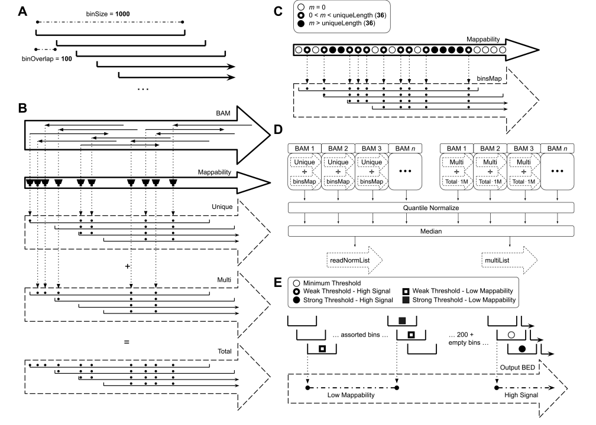
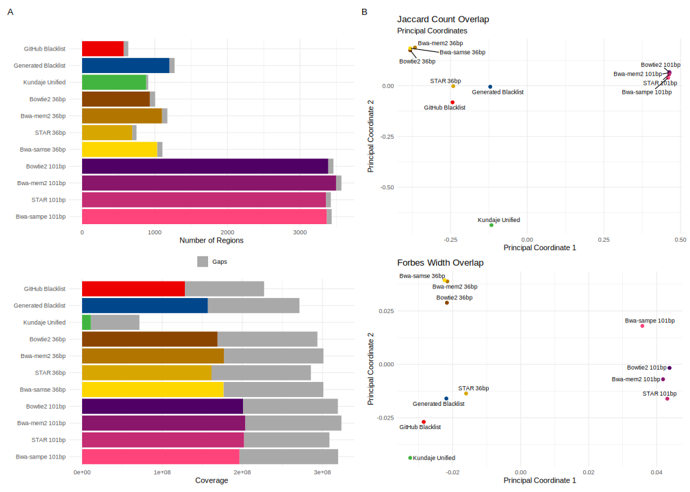
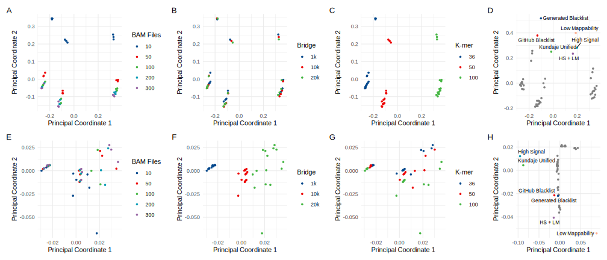
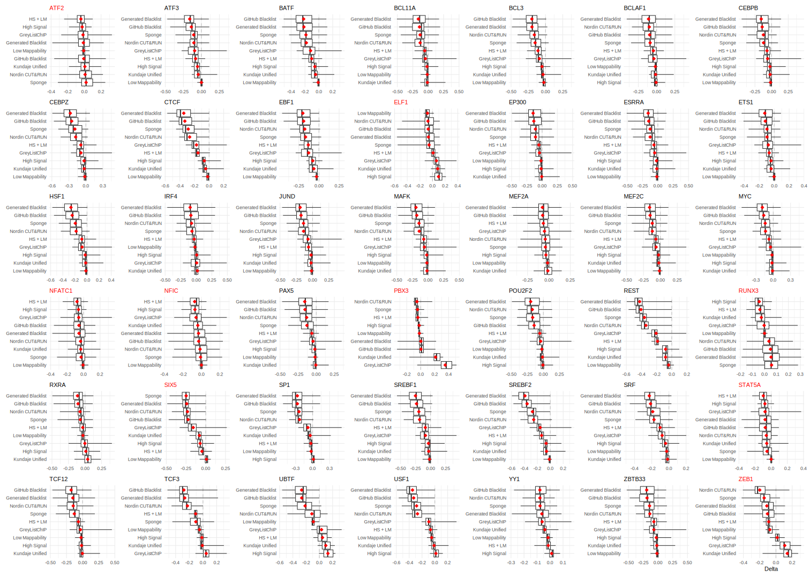

# ExcludeRanges Supplementary
A repository for supplemmental data and scripts used for our publication.

## Figures

### Figure 1

Figure 1 description

### Figure 2

Figure 2 description

### Figure 3

Figure 3 description

### Figure 4

Figure 4 description

### Figure 5

Figure 5 description

### Figure S1

Figure S1 description

### Figure S2

Figure S2 description

### Figure S3

Figure S3 description

### Figure S4

Figure S4 description

### Figure S5

Figure S5 description

### Figure S6

Figure S6 description

### Figure S7

Figure S7 description

### Figure S8

Figure S8 description

### Figure S9

Figure S9 description

### Figure S10

Figure S10 description

### Figure S11

Figure S11 description

### Figure S12

Figure S12 description

## Directories

### `./Figures`
A directory containing the data, scripts needed to make the figures, and the figures themselves used in our publication.

### `./Scripts`
A directory containing various scripts used to generate the data for our publication.
